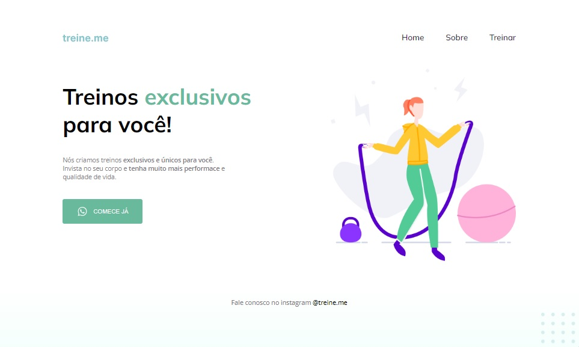
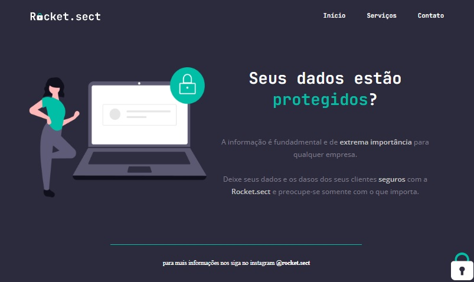

# Introdução ao HTML e CSS

    
    
    
    

 

## Introdução ao HTML e CSS
🔸 Introdução ao HTML;  
🔸 Introdução ao CSS;  
🔸 O que iremos desenvolver e o que é Figma?  
🔸 Iniciando o projeto 01;  
🔸 Estruturando o projeto 01 ; 
🔸 Apresentação e posição dos elementos na tela;  
🔸 Aplicando fontes customizadas e iniciando o CSS;  
🔸 Trabalhando com cores e fontes;  
🔸 Alinhamento texto e elementos;  
🔸 Mais ajustes de textos;  
🔸 Trabalhando com espaçamentos;  
🔸 Posicionando elementos;  
🔸 Finalizando esta etapa;  
🔸 Utilizando o codepen para enviar desafios.   
🔸 Utilizando o Github para enviar os projetos e desafios  

### Aprendizado
🔹 Utilizar ferramenta Figma ; 
🔹 Estrutura do HTML;  
🔹 Estrutura do CSS;  
🔹 Utilização de fontes personalizadas;  
🔹 Personalizar texto;  
🔹 Trabalhar com cores no CSS;  
🔹 Trabalhar com espaçamentos;  
🔹 Posicionamento de elementos: absolute, relative e fixed;  
🔹 Utilizar seletores especiais.  

### Projetos
🚀 [Móveis Customizados](URL_do_link) 
🚀 [Corrigindo Bugs](URL_do_link) 
🚀 [Flutuar.com](URL_do_link) 

 

## Conhecendo novos conceitos de HTML e CSS
🔸  Estruturando HTML com tags semânticas 
🔸  Conceito de Box Model 
🔸  Conhecento o DevTools 
🔸  Conceito de Flexbox do CSS 
🔸  Melhorias na acessibilidade e refatoração 
🔸  Adicionando as fontes e melhorando os textos 
🔸  Aplicando alinhamento e espaçamentos no main e no footer 
🔸  Configurando o botão 
🔸  Ajustes finais do projeto 

### Aprendizado
🔹  Estruturar o HTML com tags semânticas 
🔹  Aplicar o conceito de Box Model no CSS 
🔹  Utilizar o DevTools 
🔹  Posicionar e alinhar elementos com o Flex Box 
🔹  Entendimento da importância da refatoração 
🔹  Utilizar cores degradê com liner-gradient 

### Projetos
🚀 [Treine.me](URL_do_link) 
🚀 [Corrigindo Bugs](URL_do_link) 
🚀 [Semântica e Acessibilidades](URL_do_link) 
🚀 [Rockect.sect](URL_do_link) 

# 🚀 Tecnologias

<ul>
    <li>FIGMA</li>
    <li>HTML</li>
    <li>CSS</li>
</ul>

 

# 🤝 Contribuições
 
Contribuições são bem-vindas! Sinta-se à vontade para abrir uma issue para relatar problemas ou sugerir melhorias.

