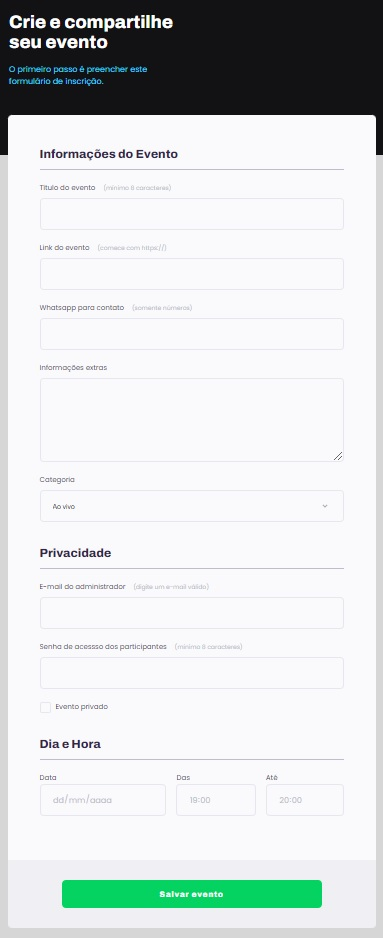
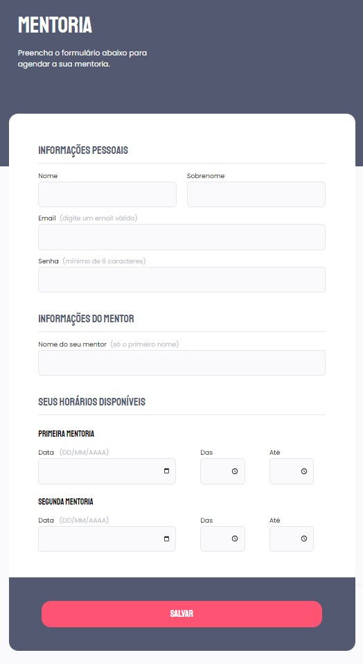
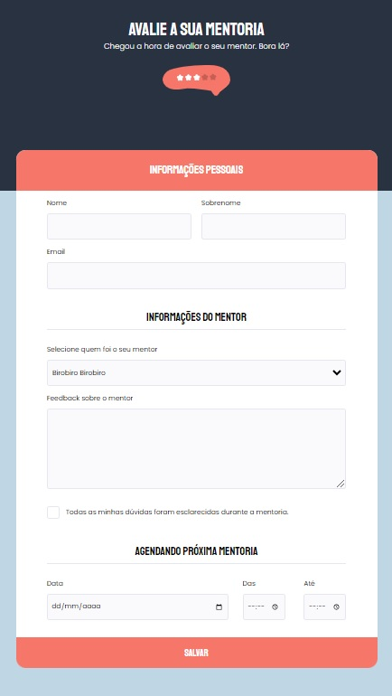
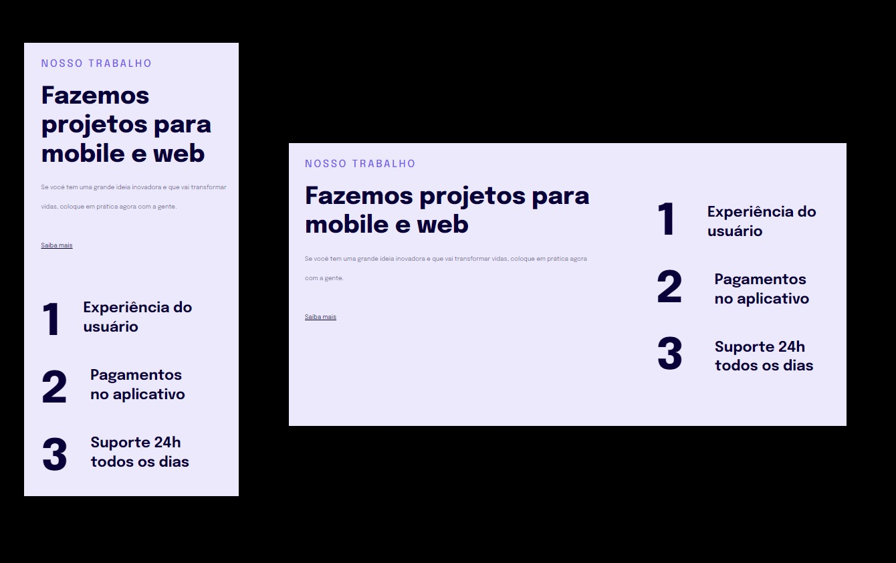

# Avançando no HTML e CSS

    
    
    
    

    

 

## Fromulários, Validações e Customizações
🔸 Entendendo os campos HTML;  
🔸 Como funcionam os formulários no HTML;  
🔸 Simulando uma busca no Google;  
🔸 Iniciando a estrutura do HTML e configurações do VSCode;  
🔸 Iniciando os estilos da página;  
🔸 Agrupando campos comm Fieldset e Legend;  
🔸 Formatando campo de texto;  
🔸 Ajustando novos campos dentro do Fieldset;  
🔸 Estilizando o campo Select;  
🔸 Aplicanto estilos aos agrupamentos restantes;  
🔸 Checkbox customizado com acessibilidade;  
🔸 Criando estilos para o Submit;  
🔸 Validando campos e submetendo formulários.  

### Aprendizado
🔹 Familiarizei-me com alguns tipos de input e alguns elementos característicos de formulários; 
🔹 Aprendi como os formulários enviam dados pelos métodos: GET e POST;  
🔹 Utilizar tags chaves para formulários;  
🔹 Trabalhar com Options e Select;  
🔹 Aplicar estilos ao Checkbox;  
🔹 Validar campos do formulário.  

### Projetos
🚀 [Formulário Eventos](URL_do_link) 
🚀 [Formulário Mentoria](URL_do_link) 
🚀 [Formulário Avaliação](URL_do_link) 

 

## Responsividade
🔸 Estruturando o HTML;  
🔸 Regra Mobile-first;  
🔸 Regras das unidades de medidas flexíveis;  
🔸 Continuando ajustes de textos;  
🔸 Finalizando ajustes da versão mobile;  
🔸 Versão Desktop;  
🔸 Finalizando esta etapa.  

### Aprendizado
🔹 Aplicar a técnica Mobile first;  
🔹 Aplicar uninades de medidas flexíveis;  
🔹 Selecionar elementos de forma isolada;  
🔹 Utilizar o Media Query.  

### Projetos
🚀 [Responsividade](URL_do_link) 

## Reforçando a responsividade
🔸 Iniciando o projeto;  
🔸 Estrutura HTML do projeto;  
🔸 Iniciando o CSS;  
🔸 Ajustudando as fontes do projeto;  
🔸 Cores e tamanho das fontes;  
🔸 Centralizando a caixa main;  
🔸 Box sizing content box;  
🔸 Ajustando espaços e preenchimentos;  
🔸 Iniciando regras desktop;  
🔸 Dividindo o encaixamento do layout;  
🔸 Ajustando as fontes e finalizando o layout para o desktop;  
🔸 Utilizando clamp nas fontes.  

### Aprendizado
🔹 Estruturar o HTML inicial; 
🔹 Estruturar o CSS inicial;  
🔹 Adicionar novas Tags para alinhamento de elementos;  
🔹 Reforçei os conceitos de Box model;  
🔹 Aplicar o Media Query;  
🔹 Preencher de elementos dentro do elemento pai;  
🔹 Utilizar fontes responsívas com o Clamp.  

 

### Projetos
🚀 [Cheesecake](URL_do_link) 

## Iniciando com o Grid
🔸 ;  
🔸 ;  
🔸 ;  
🔸 ;  
🔸 ;  
🔸 ;  
🔸 ;  
🔸 ;  
🔸 ;  
🔸 ;  
🔸 ;  
🔸 ;  
🔸 ;  
🔸 ;  
🔸   

### Aprendizado
🔹 ; 
🔹 ;  
🔹 ;  
🔹 ;  
🔹 ;  
🔹 ;  
🔹 ;  
🔹 ;  
🔹 .  

### Projetos
🚀  
🚀  
🚀  

## Avançando no CSS
🔸 ;  
🔸 ;  
🔸 ;  
🔸 ;  
🔸 ;  
🔸 ;  
🔸 ;  
🔸 ;  
🔸 ;  
🔸 ;  
🔸 ;  
🔸 ;  
🔸 ;  
🔸 ;  
🔸   

### Aprendizado
🔹 ; 
🔹 ;  
🔹 ;  
🔹 ;  
🔹 ;  
🔹 ;  
🔹 ;  
🔹 ;  
🔹 .  

### Projetos
🚀  
🚀  
🚀  

# 🚀 Tecnologias

<ul>
    <li>FIGMA</li>
    <li>HTML</li>
    <li>CSS</li>
</ul>

 

# 🤝 Contribuições
 
Contribuições são bem-vindas! Sinta-se à vontade para abrir uma issue para relatar problemas ou sugerir melhorias.

